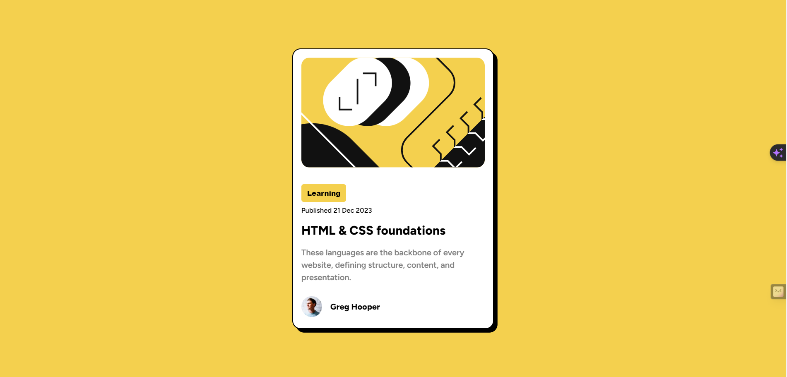

# Frontend Mentor - Blog preview card

### The challenge

Users should be able to:

- View the optimal layout for the site depending on their device's screen size

### Screenshot

;

### Links
Live Deployed Site: (https://blog-preview-card-fm-atool.netlify.app/)

## My process

### Built with

- Semantic HTML5 markup
- CSS custom properties

### Body Copy

- Font size (paragraph): 15px

### Font

- Family: [Outfit](https://fonts.google.com/specimen/Outfit)
- Weights: 400, 700