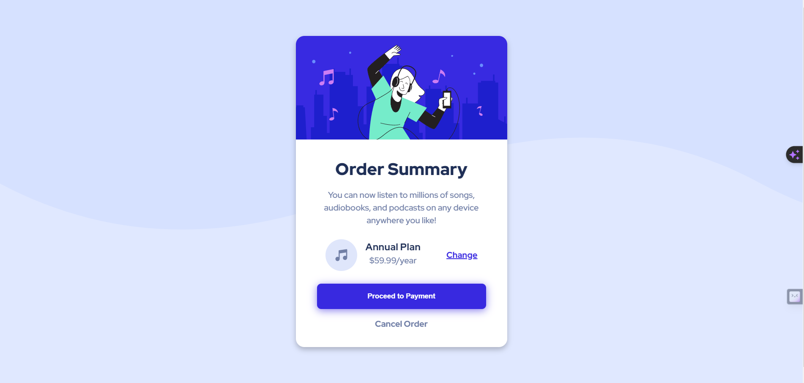

# Frontend Mentor - Order summary card

### The challenge

Users should be able to:

- View the optimal layout for the site depending on their device's screen size

### Screenshot

;

### Links
Live Deployed Site: (https://order-summary-card-fm-atool.netlify.app/)

## My process

### Built with

- Semantic HTML5 markup
- CSS custom properties

### Body Copy

- Font size (paragraph): 16px

### Font

- Family: [Red Hat Display](https://fonts.google.com/specimen/Red+Hat+Display)
- Weights: 500, 700, 900